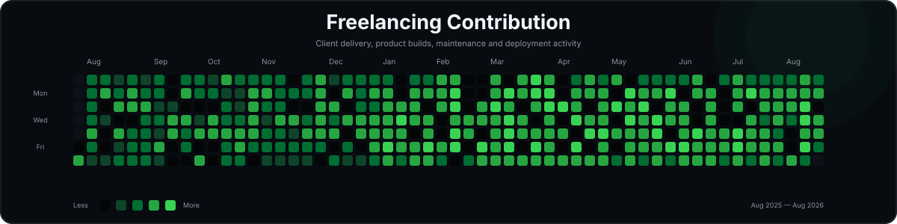

<p align="center">
  
</p>

<p align="center">
  
</p>

<p align="center">
  <a href="https://github.com/yashchokhat"></a>
  <a href="https://github.com/yashchokhat"></a>
  <a href="mailto:ychokhat@gmail.com"></a>
</p>

<p align="center">
  
</p>

---

<p align="center">
  
</p>

---

## About

I am a Computer Engineering student, software developer, freelancer, and founder of Vertex Lab focused on building scalable software across web, mobile, cloud infrastructure, DevOps, AI-enabled applications, and IoT.

My current direction is centered on cloud-native development, infrastructure automation, CI/CD, container orchestration, AWS, LLMOps, and high-level system design.

---

## What I Build

```text
FULL STACK
React / Next.js / Node.js / Flask / MERN / Flutter / React Native

CLOUD & DEVOPS
AWS / Docker / Kubernetes / Terraform / GitHub Actions / Linux / CI/CD

AI & AUTOMATION
LLM Integration / LLMOps / Generative AI / Automation

PRODUCT ENGINEERING
Web Platforms / Mobile Apps / IoT Systems / Cloud Deployments
```

---

## DevOps Stack

<p align="center">
  
</p>

<p align="center">
  
</p>

<p align="center">
  
</p>

---

## Engineering Activity

<p align="center">
  
</p>

<p align="center">
  
</p>

---

## Experience

### Vertex Lab
**Founder** · April 2023 — Present

Building software products and client solutions across web, mobile, cloud, AI, IoT, and infrastructure engineering.

`Full Stack` `Cloud` `DevOps` `LLMOps` `IoT` `System Design`

### NuageCX Consulting Pvt. Ltd.
**Software Developer** · August 2025 — February 2026

Production-oriented software development and application engineering.

### Calisnova — CIIIT TBI, Ramdeobaba University
**Development Team Lead** · November 2025 — January 2026

**Full Stack Developer** · October 2025 — November 2025

Application development and technical implementation within a product-development environment.

### Netbugs Solutions & Services LLP
**React Developer** · May 2024 — August 2024

React application development.

### Ed-Tech
**Android Developer** · June 2024 — July 2024

Android application development.

---

## Recognition

<p align="center">
  
  
</p>

<p align="center"><b>2× National-Level Event Winner</b></p>

---

## Certifications

```text
Google GCCF Certified
Advanced JavaScript
React and Redux Certification
AI Associate
Prime Batch (AI/ML)
Introduction to Artificial Intelligence — Microsoft Azure
```

---

## Publication

### Embedded Automation System Development with IoT & React Application

Publication focused on combining IoT automation with modern React application development.

---

<p align="center">
  
</p>

<p align="center"><sub>Designing systems. Building products. Automating infrastructure.</sub></p>
